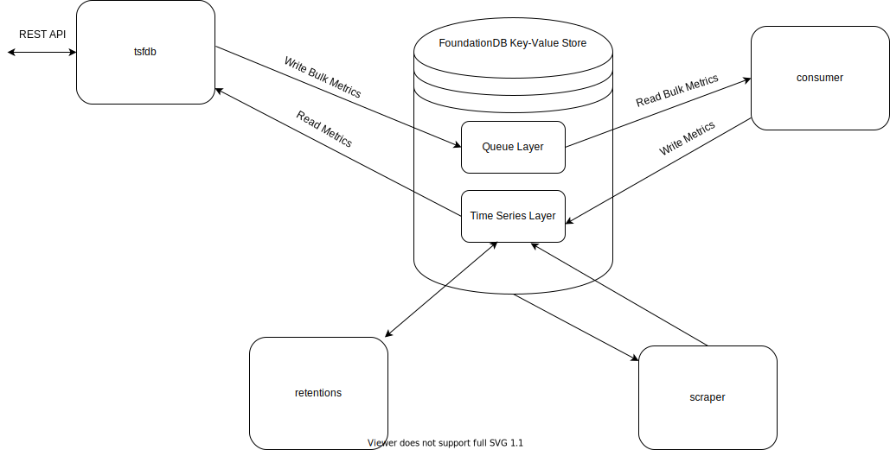

# TSFDB server

## Overview
TSFDB is a Time Series Database built on top of FoundationDB.
TSFDB uses the [Connexion](https://github.com/zalando/connexion) library on top of Flask.

## Architecture
TSFDB employs several processes with different purposes
* tsfdb: uWSGI powered web app which reads and writes metrics from/to FoundationDB
* tsfdb-consumer: Process which consumes queues written by tsfdb and transforms metrics from bulk data to a key-value format
* tsfdb-retentions: Process which applies a retention policy in order to conserve storage (Optional)
* tsfdb-scraper: Process which scrapes FoundationDB status data and stores it in the Time Series layer (Optional)



## Running with docker-compose
#TODO

## Running with Kubernetes

```bash
# adding the mist helm repo
helm repo add mist https://mist-charts.storage.googleapis.com

# installing the helm chart
helm install mist/tsfdb
```
### Notes:
The FoundationDB operator should be present on the cluster before installing tsfdb.

## Operations Playbook
### Before Deploying
1) Redundancy levels

   | Redundancy  | Storage Processes |
   | :---------: | :---------------: |
   | single      | 1-2               |
   | double      | 3-4               |
   | triple      | 5+                |

2) Number of Storage & Log Processes that have been tested successfully
   | Storage     | Log  | Metrics  |
   | :---------: | :--: | :------: |
   | 4           | 3    | 2.3K     |
   | 8           | 4    | 10.4K    |

### During Operation
These instructions are based on the internal tsfbd metrics exposed as a prometheus endpoint.
1) Degraded processes\
 #TODO
2) Least Operating Space Storage / Log\
 if the space storage is decreasing dramatically try to either:
   * Scale up the cluster (Storage or Log)
   * Apply more aggressive retentions
3) Moving Data in Flight / Queue\
Flight -> Actual data being transferred\
Queue -> Data that is planed to move\
 if MDF or MDQ > 10% Total key-value space then it means that there is a lot of data transfer\
 Try to either:
   * Alter the knobs for data relocation
        ```
        - knob_relocation_parallelism_per_source_server=6
        - knob_fetch_keys_parallelism_bytes=1e+07
        - knob_max_outstanding=256
        ```
   * Scale up the cluster (Storage or Log)
4) Total Queues, Resources, Queues Sizes\
if Total Queues == Resources or avg(Queue Size > 10) or non realtime metric data then:
   * Scale up tsfdb producers, usually 1 producer to 5 monitored resources
5) Worst Storage / Log Queue Size\
   if Storage Queue > 900MB or Log Queue > 1.6GB -> throttling happens\
   Try to:
   * Scale up the cluster (Storage or Log)
   * Alter the knobs for relocation
        ```
        - knob_relocation_parallelism_per_source_server=6
        - knob_fetch_keys_parallelism_bytes=1e+07
        - knob_max_outstanding=256
        ```
6) Storage Data lag / Worst lag between log and storage\
   if lag > 1 min and increasing, then there is definitely a problem:
   Try the same as 5. Usually 5,6 happen together.

### Sources
* https://forums.foundationdb.org/t/how-to-detect-node-failure/1821/2
* https://forums.foundationdb.org/t/what-do-you-monitor/184/21
* https://apple.github.io/foundationdb/configuration.html#single-datacenter-modes
